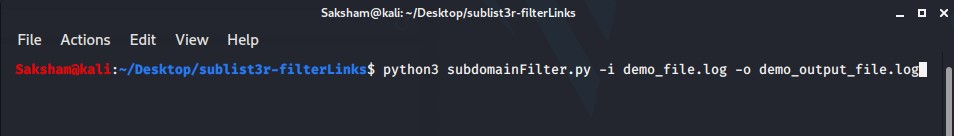
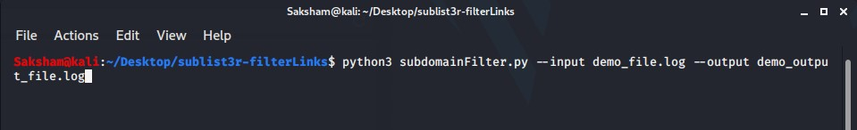
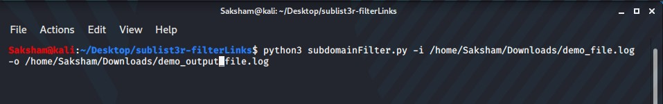

This python scripts filters the results from the Sublist3r and sorts that to a list of responding web sub-domains 

It does the following by :
1. Reading the output file from sublist3r 
2. Make a sorted list without explict information
3. Performs a ping test to each host
4. Adds all the responding hosts to an output file

/*********************************************** 
**<i> Note : This Script only works with python3  </i> ** 
***********************************************/

<b>How to run this script : </b> 
python3 subDomainFilter.py [-i/--input] <name_of_the_input_file> [-o/--output] <name_of_the_output_file>

<b>Python Command :</b>
 

<i>short verbose :<i>

  
<i>verbose containing complete arguments :<i>

  
<i>verbose containing complete arguments and file dir :<i>

